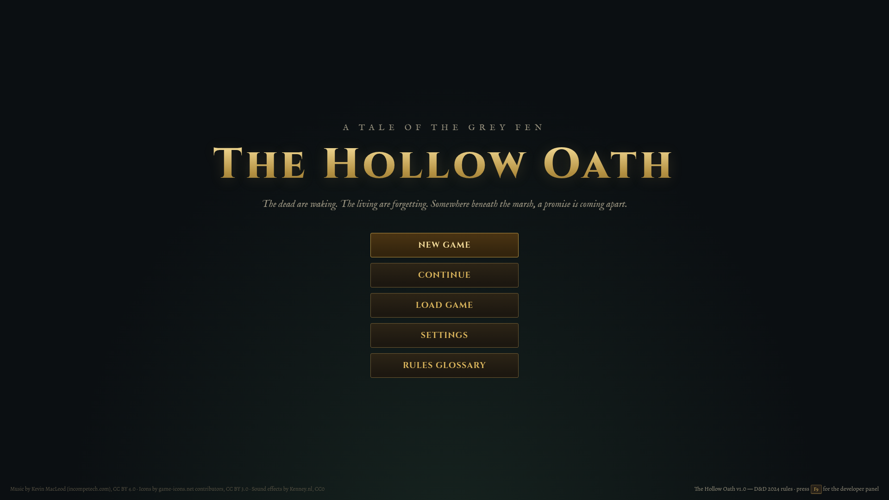
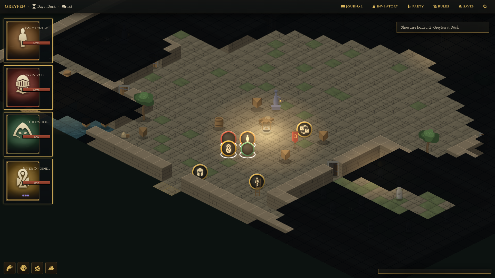
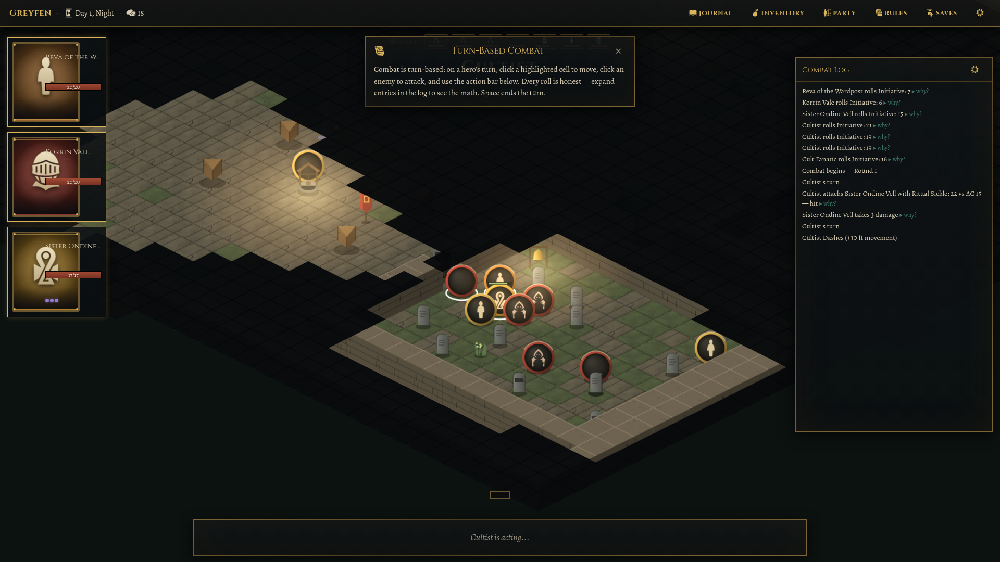
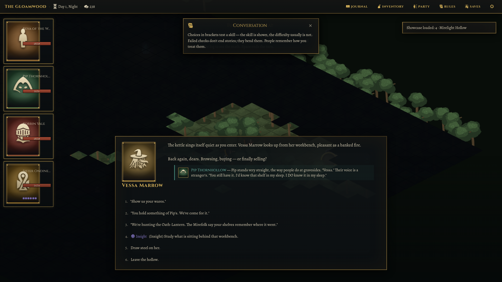

# The Hollow Oath

*A tale of the Grey Fen.* The dead are waking, the living are forgetting, and somewhere beneath the marsh a two-hundred-year-old promise is coming apart — or being taken apart.

**The Hollow Oath** is a complete desktop browser CRPG built on the D&D 2024 revised rules: a party-based isometric adventure with turn-based tactical combat, a reactive investigation story, four companions with personal arcs, and four substantially different endings.



## Quick start

Requires Node 18+ and a desktop browser (Chromium recommended). The game targets **1920×1080**.

```bash
npm install
npm run dev        # development server
# or
./start-game.sh    # build + serve production bundle (start-game.bat on Windows)
```

Then open the printed local URL. No network access is needed at runtime — every asset is bundled.

### Scripts

| Command | What it does |
|---|---|
| `npm run dev` | Vite dev server |
| `npm run build` | Production build to `dist/` |
| `npm run preview` | Serve the production build |
| `npm test` | Vitest unit suite (rules engine, content integrity, persistence) |
| `npm run e2e` | Playwright end-to-end flows at 1920×1080 |
| `npm run typecheck` / `npm run lint` | Static checks |

## The game

- **Story** — Greyfen, a fen-frontier town, is losing its memories while its dead refuse to stay buried. The trail runs from a desecrated graveyard through a dark forest and a drowned causeway to a buried temple, and ends at the Pact Chamber, where the town's founding bargain waits for someone to settle it. One main quest, four side quests, four companion arcs, 25+ named characters, and four endings (plus conditional epilogues) — driven by evidence you gather, factions you back, and promises you keep.
- **Rules** — D&D 2024 revised: six classes (Fighter, Rogue, Cleric, Wizard, Ranger, Warlock) with subclasses at level 3, six species, six backgrounds, 27-point buy, weapon masteries, Battle Master maneuvers, warlock invocations, configurable reactions (opportunity attacks, Riposte, Shield…), honest death saves, milestone leveling 1–4. See [RULES_IMPLEMENTATION.md](RULES_IMPLEMENTATION.md) for fidelity notes.
- **Combat** — turn-based on a 5-ft grid (isometric), with cover, flanking-free honest positioning, lighting and stealth, interruptible reaction timing, and a combat log where every roll can be expanded to show its math. Dice are never fudged on any difficulty.
- **Exploration** — party movement, fog of war, dynamic lighting, traps, secrets, skill-gated routes, puzzles (a bell rite, a founders' cipher, wardstone runes, a memory clock…), shops, resting and camp life.
- **Determinism** — all randomness flows from a seeded PRNG with named streams; the seed is on the character-creation screen and in the dev panel. Same seed + same choices = same story.





## Controls

| Input | Action |
|---|---|
| Left-click | Move / interact / attack / select |
| Right-click drag, edge pan, WASD/arrows | Camera |
| Mouse wheel | Zoom |
| `1–9` | Dialogue options / action bar slots |
| `Space` | End turn (combat) |
| `V` / `X` / `R` | Sneak / Search / Rest |
| `I` `J` `C` `G` `O` | Inventory · Journal · Character sheet · Rules glossary · Settings |
| `F5` / `F8` | Quicksave / Quickload |
| `F9` | Developer panel (seed, cheats, showcase states) |
| `Esc` | Close panel / settings |

## Difficulty

- **Story** — fewer spawns, earlier hints, immediate defeat assistance. Same dice.
- **Adventurer** — the intended experience.
- **Tactician** — extra spawns, scarcer supplies, later hints. Same dice.

Difficulty never fudges rolls or hides stat changes; it only changes content and pacing.

## Documentation

| File | Contents |
|---|---|
| [GAME_DESIGN.md](GAME_DESIGN.md) | Campaign bible: story, areas, quests, encounters, puzzles |
| [RULES_IMPLEMENTATION.md](RULES_IMPLEMENTATION.md) | What's implemented from D&D 2024, deviations and why |
| [BUILD_LOG.md](BUILD_LOG.md) | Architecture decisions and build chronology |
| [DEMO_GUIDE.md](DEMO_GUIDE.md) | 10-minute tour + the six showcase states |
| [ASSET_SOURCES.md](ASSET_SOURCES.md) | Every asset's origin and license |
| [ART_GENERATION_PROMPTS.md](ART_GENERATION_PROMPTS.md) | Prompts for regenerating illustrated art, should you want to |
| [KNOWN_LIMITATIONS.md](KNOWN_LIMITATIONS.md) | Honest list of cut corners and simplifications |

## Credits & licenses

Code is original. Bundled third-party assets: fonts (Cinzel, Alegreya, IM Fell — SIL OFL 1.1), iconography (game-icons.net — CC BY 3.0), music (Kevin MacLeod, incompetech.com — CC BY 4.0), sound effects (Kenney.nl — CC0). Full details in [ASSET_SOURCES.md](ASSET_SOURCES.md). Terrain, props, portraits, and tokens are generated procedurally at boot from the game's own seeded painter.

D&D 2024 rules are implemented from the System Reference Document 5.2 under the Creative Commons Attribution 4.0 license. This is an unofficial fan work; no Wizards of the Coast trademarks are claimed.
